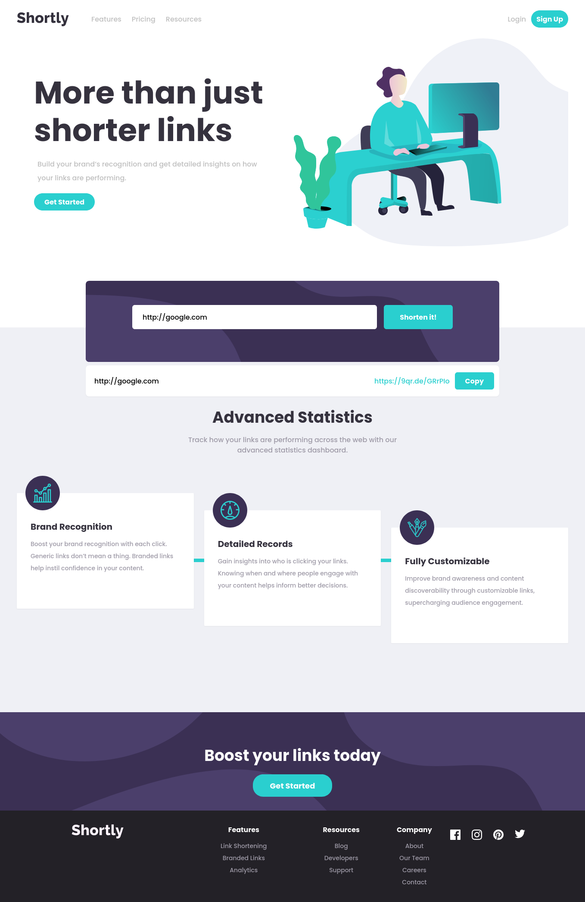

# Frontend Mentor - Shortly URL shortening API Challenge solution

This is a solution to the [Shortly URL shortening API Challenge challenge on Frontend Mentor](https://www.frontendmentor.io/challenges/url-shortening-api-landing-page-2ce3ob-G). Frontend Mentor challenges help you improve your coding skills by building realistic projects.

## Table of contents

- [Overview](#overview)
  - [The challenge](#the-challenge)
  - [Screenshot](#screenshot)
  - [Links](#links)
- [My process](#my-process)
  - [Built with](#built-with)
  - [Useful resources](#useful-resources)
- [Author](#author)

**Note: Delete this note and update the table of contents based on what sections you keep.**

## Overview

### The challenge

Users should be able to:

- View the optimal layout for the site depending on their device's screen size
- Shorten any valid URL
- See a list of their shortened links, even after refreshing the browser
- Copy the shortened link to their clipboard in a single click
- Receive an error message when the `form` is submitted if:
  - The `input` field is empty

### Screenshot

### Links

- Solution URL: [Add solution URL here](https://your-solution-url.com)
- Live Site URL: [link shorter challenge live](https://mmasoudih.github.io/link-shorter-challenge/)

## My process

### Built with

- Mobile-first workflow
- [Axios](https://github.com/axios/axios) - for API call
- [Vue.js (v3)](https://v3.vuejs.org/) - JavaScript Framework
- [Tailwind CSS](https://tailwindcss.com/) - A utility-first CSS Framework

### Useful resources

- [URL Regex](https://stackoverflow.com/a/17773849/13798095) - This helped me for check validation of an URL
- [Fill SVG](https://stackoverflow.com/a/64204836/13798095) - This helped me for change color of SVG using Tailwind CSS

## Author

- Frontend Mentor - [@mmasoudih](https://www.frontendmentor.io/profile/mmasoudih)
- Telegram - [@mmasoudi79](https://t.me/mmasoudi79)
